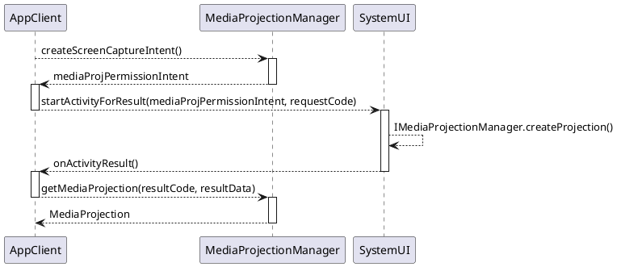
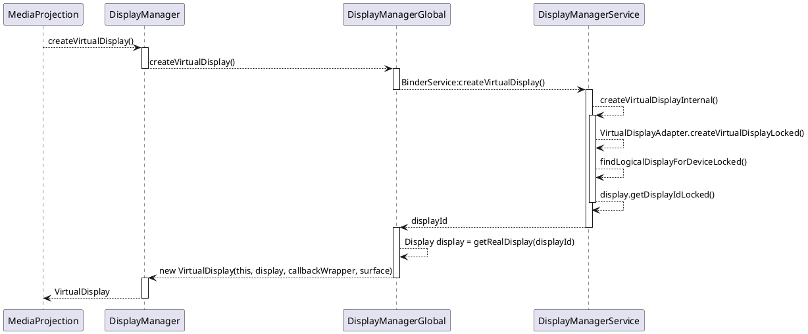

```puml
@startuml

participant AppClient as AC
participant MediaProjectionManager as MPM
participant SystemUI as S

AC --> MPM++: createScreenCaptureIntent()
MPM --> AC--++: mediaProjPermissionIntent
AC --> S--++: startActivityForResult(mediaProjPermissionIntent, requestCode)
S --> S: IMediaProjectionManager.createProjection()
S --> AC--++: onActivityResult()
AC --> MPM--++: getMediaProjection(resultCode, resultData)
MPM --> AC--: MediaProjection

@enduml
```

```puml
@startuml

participant MediaProjection as MP
participant DisplayManager as DM
participant DisplayManagerGlobal as DMG
participant DisplayManagerService as DMS

MP --> DM++: createVirtualDisplay()
DM --> DMG--++: createVirtualDisplay()
DMG --> DMS--++: BinderService:createVirtualDisplay()
DMS --> DMS++: createVirtualDisplayInternal()
DMS --> DMS: VirtualDisplayAdapter.createVirtualDisplayLocked()
DMS --> DMS: findLogicalDisplayForDeviceLocked()
DMS --> DMS--: display.getDisplayIdLocked()
DMS --> DMG--++: displayId
DMG --> DMG: Display display = getRealDisplay(displayId)
DMG --> DM--++: new VirtualDisplay(this, display, callbackWrapper, surface)
DM --> MP-- : VirtualDisplay

@enduml
```

